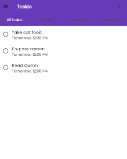

# Taskio

This is a simple To-Do List app built using Flutter and SQLite. It allows users to create, update, and mark notes as completed. The app uses `hive` for local database storage and provides an interactive user interface.

## Features
- Add new notes
- Update note status (mark as completed or pending)
- Display notes with priority and completion status
- View the count of completed and total notes

## Preview

